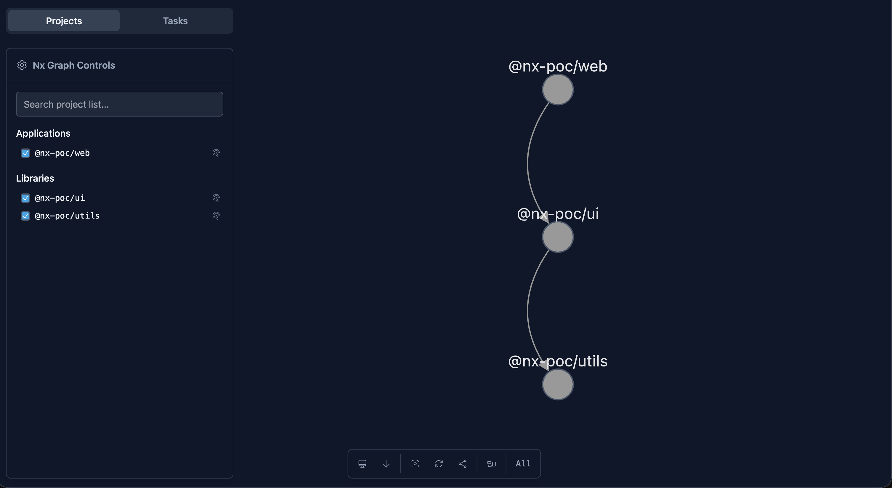
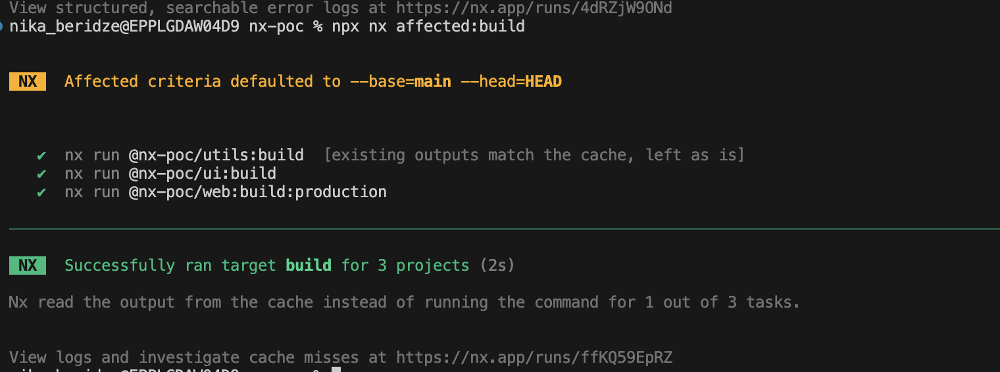
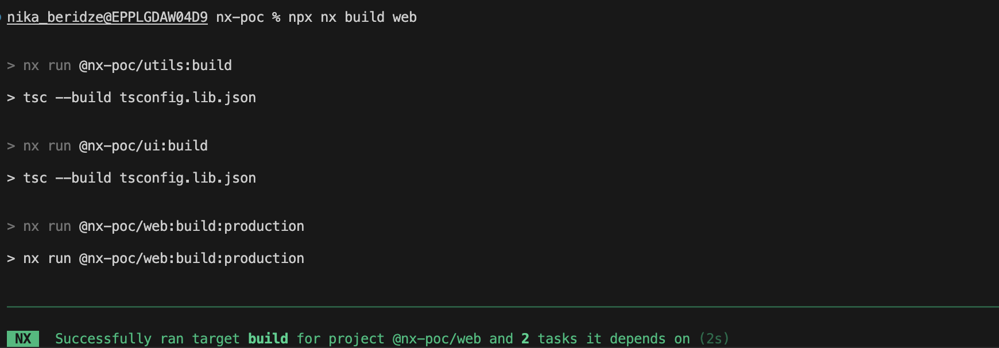
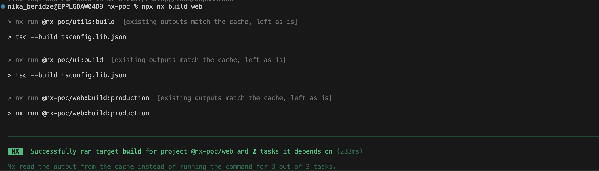

# NX POC – Minimal Demo for Graph, Affected Builds, and Cache

## Goal

This POC demonstrates three core NX capabilities in a minimal workspace:

1. **Dependency graph**
2. **Affected builds**
3. **Computation cache**

The idea is to keep the demo small enough for a **5–10 minute walkthrough**.

---

## 1. Create a New NX Workspace

```bash
npx create-nx-workspace@latest nx-poc
```

Recommended option:

```text
None: Configures a TypeScript/JavaScript monorepo
```

```text
✔ Which stack do you want to use? · none
✔ Would you like to use Prettier for code formatting? · Yes
✔ Which CI provider would you like to use? · skip
✔ Would you like remote caching to make your build faster? · yes
```

Then enter the workspace:

```bash
cd nx-poc
```

---

## 2. Generate One App and Two Libraries

install nx/node
```bash
npm install --save-dev @nx/node
```

then

```bash
npx nx g @nx/node:app web
npx nx g @nx/node:lib ui
npx nx g @nx/node:lib utils
```

Expected structure:

```text
apps/
  web/

libs/
  ui/
  utils/
```

---

## 3. Create a Simple Dependency Chain

The goal is to create this dependency chain:

```text
utils -> ui -> web
```

### In `libs/ui`
Import something from `utils`.

Example:

```ts
import { someUtil } from '@nx-poc/utils';
```

### In `apps/web`
Import something from `ui`.

Example:

```ts
import { someUiHelper } from '@nx-poc/ui';
```

This is enough for NX to detect relationships between projects.

---

## 4. Show the Dependency Graph

Run:

```bash
npx nx graph
```

and you will see graph like that - 


What this demonstrates:

- NX understands relationships between projects
- NX builds a project graph from imports and project metadata
- The repo structure becomes visible to the team

Expected takeaway:

```text
utils -> ui -> web
```

---

## 5. Show Affected Builds

Change a file in `utils`, for example:

```text
libs/utils/src/lib/utils.ts
```

Then run:

```bash
npx nx affected:build
```

you will see: 



What this demonstrates:

- NX uses Git diff to determine what changed
- NX walks the dependency graph
- NX runs builds only for affected projects

Expected affected chain:

```text
utils
ui
web
```

This is the main value of NX for CI optimisation.

---

## 6. Show Cache

Clear cache:

```bach
npx nx reset
```

Run the build once:

```bash
npx nx build web
```


Then run it again:

```bash
npx nx build web
```

Expected result:

```text
✔ utils (cached)
✔ ui (cached)
✔ web (cached)
```


What this demonstrates:

- NX hashes task inputs
- NX detects that nothing has changed
- NX restores previous results from cache instead of re-running the tasks

This is the second major value of NX for developer experience and CI speed.

---

## 7. Optional: Show the Difference After a Change

Change a file in `ui`, for example:

```text
libs/ui/src/lib/ui.ts
```

Then run:

```bash
npx nx affected:build
```

Expected affected chain:

```text
ui
web
```

`utils` should not be rebuilt if it was not affected.

This makes the incremental behaviour easier to explain.

---

## 8. Suggested Demo Flow

A practical walkthrough can look like this:

1. Show the project structure
2. Run `npx nx graph`
3. Change a file in `utils`
4. Run `npx nx affected:build`
5. Run `npx nx build web` twice
6. Point out cache hits

This should take about **5–10 minutes** and is enough to show the key value of NX.

---

## 9. What This POC Proves

This minimal NX demo provides:

- **graph-based understanding of the repository**
- **incremental execution through affected detection**
- **faster repeated builds through cache**
